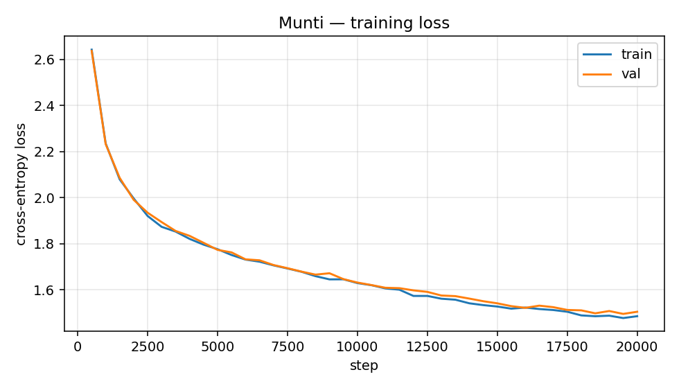

# Munti — building a language model from scratch

> A 12.5M-parameter transformer, written in pure PyTorch, trained on TinyStories
> for 44 minutes on a free Kaggle T4. Final val loss **1.505**. Total cost: ₱0.

I have fine-tuned models before. That teaches you the API, not the machine. So I
wrote one from the bottom: the tokenizer, the attention, the training loop, the
sampler. No pretrained weights, no `GPT2LMHeadModel`, nothing imported that does
the actual work.

This is what I learned, including the part where my prediction was wrong.

---

## 1. How the thing actually works

A language model does one job: given some tokens, put a probability on every
possible next token. Everything else — chat, summarizing, code — is that one
operation in a loop.

The model is a stack of identical blocks. Each block does two things, each
wrapped in a residual connection:

**Attention** is the only place information moves *between* positions. Every
token emits three vectors: a query ("what am I looking for?"), a key ("what am
I?"), and a value ("what I'll hand over if picked"). Score every query against
every key, mask out the future, softmax into weights, return the weighted sum of
values. "Multi-head" means slicing the embedding into 6 independent pieces and
doing that separately in each, so different heads can specialize — one batched
matmul, not a loop.

**The MLP** is where each token thinks about what it just gathered. Expand 4x,
GELU, project back. No cross-token movement at all; the same small network runs
independently at every position.

Three details I did not appreciate until I had to write them:

- **The `1/√head_dim` scale in attention isn't cosmetic.** Dot products grow with
  dimension. Without the scale, the softmax saturates, gradients vanish, and the
  model learns nothing. It's one division that decides whether training works.
- **Pre-LN vs post-LN is a real fork.** Normalizing *before* each sub-layer keeps
  the residual stream a clean identity path from input to loss. Post-LN puts a
  layernorm on that path and deep stacks need careful warmup to train at all.
- **The causal mask is where silent bugs live.** If position `i` can see position
  `j > i`, the model is peeking at the answer. Training loss looks *better*, and
  generation is garbage — because at generation time the future isn't there.
  Nothing about the loss curve tells you. I wrote a test for exactly this.

## 2. The decision that saved the project

**Before spending a single GPU hour, prove the code is correct.**

The failure mode I wanted to avoid: train for six hours, get gibberish, and have
no way to tell whether it's a bug or just under-training. That question can eat
days.

So the gate ([`test_munti.py`](test_munti.py)) runs on CPU in under a minute:

| test | what it catches |
|---|---|
| init loss ≈ `ln(vocab)` = 8.32 | dead head, mis-shaped output projection |
| perturb token `t` → logits at `< t` unchanged | causal mask leakage |
| fused attention == manual attention | the speed switch changing results |
| no-pos config is permutation-invariant at position 0 | the ablation not ablating |
| **overfit 4 fixed batches → loss < 0.05, 100% greedy recall** | anything else |

The last one is the real gate. A correct model *must* be able to memorize four
batches. If it can't, it is broken, and no amount of data will save it. It hit
loss 0.0000 with 100% greedy recall.

That test caught a bug immediately — my first version passed `targets=x`, and
because of weight tying (the output projection *is* the embedding matrix) the
residual stream still carries the input embedding, so "predict yourself" is
trivially easy and the init loss came out at 4.14 instead of 8.32. The test was
wrong, not the model. Worth knowing before it becomes a confusing result.

## 3. Tokenizer

Byte-level BPE, 4096 vocab, trained on TinyStories here — not downloaded.

Char-level would have been simpler, but it costs ~4 tokens where BPE costs 1:
measured **3.96 characters per token**. With a fixed 256-token context, char-level
would see a quarter as much story per window. Same compute, less text.

Byte-level matters for a second reason: the base alphabet is the 256 byte values,
so every possible UTF-8 string is representable and there is no unknown token,
ever. That is what makes the pipeline language-agnostic — a Tagalog version is a
corpus swap, not a rewrite.

## 4. Training

| | |
|---|---|
| params | 12,292,992 |
| layers / heads / width | 6 / 6 / 384 |
| context | 256 tokens |
| corpus | 2,119,719 stories → ~536M tokens |
| steps | 20,000 × batch 64 × 256 = 327M tokens (~0.6 epoch) |
| hardware | one free Kaggle T4, fp16 + gradient scaler |
| **time** | **44.4 minutes** |
| **final** | **train 1.486 / val 1.505** |



Train and val land within 0.02 of each other — no overfitting, which is what you
expect when a small model sees only 0.6 of an epoch. The curve has no spikes: the
warmup, cosine decay and gradient clipping did their job.

The boring parts are the ones that decide whether a run survives. Warmup exists
because Adam's variance estimates are garbage at step 0 and a full-size step then
can wreck the initialization permanently. Gradient clipping exists because one
bad batch is the usual cause of "loss went to NaN at hour three." Exact
checkpoint/resume exists because free GPU sessions get killed at 9 hours.

### What it learned, in order

The checkpoint progression is my favourite artifact, because grammar arrives long
before sense:

**Step 500** (val 2.64) — sentence shapes correct, meaning absent:
> she saw a peel on the ground and asked it it might be mad

**Step 5,000** (val 1.77) — coherent scenes, trailing off:
> One day, Lily's mommy asked her to clean her up before dinner. Lily didn't want to clean her room because she wanted to play with her dolls…

**Step 20,000** (val 1.51) — characters persist, dialogue works:
> "Wow, your toys look so cool!" said Timmy. "Thank you!" said Lily. Timmy asked, "Do you like my toys?"

The model learns *syntax* first and *semantics* later. Full samples:
[results/samples.md](results/samples.md).

## 5. The ablation — where I was wrong

I removed the learned positional embeddings (`learned_pos: false`), same seed,
same steps, and — by mounting the baseline run's output — the *same token stream*.
One variable.

**My prediction: fluent-looking word salad.** The reasoning seemed airtight.
Attention is a weighted sum, and a sum doesn't care about order. The positional
embedding table is the model's only explicit source of word order. Remove it and
the model should know *which* words go together but not in what sequence.

**What actually happened:**

| model | val loss | Δ |
|---|---|---|
| baseline | 1.5051 | — |
| no positional embeddings | 1.5444 | **+0.039** |

Roughly four hundredths of a nat — and, as the replicate below shows, even that
figure is more precise than the experiment earns. The text stayed coherent:

> Tom found a shiny red box under the tree. He was very happy and said, "Wow, look at this box! It's so pretty!"

That is not word salad. My model of the problem was wrong.

### Chasing it down

Two explanations fit: either the model ignores order and TinyStories is
predictable enough from a bag of recent words, or the model still knows the order
and got it somewhere else.

So I measured it, rather than picking whichever I preferred. Score each model on
ordinary validation text, then on the same text with tokens shuffled inside each
window. A model that ignores order barely notices. A model that uses order falls
apart.

| model | val | val, tokens shuffled | Δ |
|---|---|---|---|
| baseline | 1.4946 | 9.5179 | +8.02 |
| no positional embeddings | 1.5430 | 9.7286 | **+8.19** |

The no-positions model is *more* order-sensitive than the baseline. It is not
remotely order-blind.

**The explanation:** causal masking leaks position. Token 5 attends over a
5-token prefix; token 50 attends over 50. Prefix length is itself a positional
signal, and the model learned to read it. This is a known result (Haviv et al.,
2022 — transformers without positional encodings still learn positional
information), and it is specific to *causal* models. A bidirectional encoder
stripped of positions really would be helpless.

My own test hinted at this and I misread it. `test_no_pos_is_order_blind` only
asserts that *position 0* is permutation-invariant — true, and much weaker than
the whole sequence being order-blind. I had written the evidence against my own
prediction and not noticed.

A side note: shuffled loss of ~9.5 is *worse* than the 8.32 you'd get from
predicting uniformly at random. The model doesn't degrade into uncertainty on
scrambled text — it stays confident and is confidently wrong.

### One number, measured twice

A single evaluation is a reading, not a measurement. The gap swings between
+0.037 and +0.063 across the last five evals of the *same* run pair, so quoting
"0.039" implies a precision this experiment doesn't have. I reran both arms at a
second seed — identical but for `seed: 1338`, on the same token stream.

| seed | baseline | no positions | gap (mean, last 5 evals) | spread |
|---|---|---|---|---|
| 1337 | 1.5038 | 1.5504 | +0.0467 | 0.037 – 0.063 |
| 1338 | 1.5010 | 1.5409 | +0.0400 | 0.024 – 0.052 |
| **pooled** | | | **+0.043** | **0.024 – 0.063** |

The effect reproduces, and the control that makes it believable is the baseline
column: two independent runs landed **0.003 apart**, while the gap they're
measuring is **~0.04**. Between-seed noise is an order of magnitude smaller than
the effect, so this is a real difference that is simply imprecise — not a mirage.

**The real conclusion** is more useful than the one I expected: explicit
positional embeddings are worth **roughly 0.04 nats** here, because a causal
decoder gets most of that information free from its own masking.

I ran this because a sibling project of mine exists largely to document seed
noise faking a result. Publishing "0.039" without the replicate would have
repeated the exact mistake that project is about.

## 6. Can do / can't do

Grounded in real generations at temperature 0.8 —
[results/final_generations.md](results/final_generations.md).

### Can

- Write grammatical, multi-paragraph children's stories with a beginning, middle
  and end
- Maintain a character's name and pronoun across paragraphs
- Produce working dialogue with correct attribution and quoting
- Continue a held-out prompt in a consistent style

### Cannot

**Answer a question.** Asked *"What is the capital of France?"*:
> Her Mom laughed and said "that's the container of Santa. He's coming to visit us!"

**Know a fact.** Given *"The mitochondria is"*:
> a friend for you. Come on, let's go and find the star in the dark room.

**Write code.** Given `def fibonacci(n):`:
> "Thank you for marrying me." Snow smiled and replied, "I am happy that you two are very tough."

**Track entities reliably** — this fails inside its *good* samples:
> He opened the box and found a box!

> The cat and the cat became friends and played together every day.

None of this is a defect. The model saw simple children's stories and nothing
else; it learned exactly that distribution. A 12M-parameter model trained for 44
minutes on one narrow corpus has no mechanism for facts, arithmetic or code. It
is a demonstration of the machinery, not a useful assistant, and quoting the
failures is more honest than a benchmark table that hides them.

## 7. What I'd do differently

- **Check hardware assumptions first.** Kaggle handed me a P100, which the
  installed PyTorch doesn't support at all (sm_60 vs sm_70+ minimum). Everything
  before training is CPU work, so the run looked healthy for ten minutes before
  it would have died. The fix was a 3-line assert in the first cell.
- **`torch.cuda.is_bf16_supported()` lies.** It counts emulation and returned
  `True` on that P100. Gate on compute capability ≥ 8.0 instead, or you silently
  pick a path with no hardware behind it.
- **Predict, then measure — and publish both.** The ablation is the most
  interesting part of this project precisely *because* I was wrong about it. If I
  had reported the 0.039 gap without probing it, I would have shipped a true
  number with a false explanation attached.

## 8. Reproduce it

```bash
pip install -e .
python test_munti.py                    # correctness gate, CPU, <1 min
python -m munti.data prepare            # TinyStories → token streams
python -m munti.train --config configs/munti-12m.yaml
python -m munti.sample --ckpt out/ckpt.pt --prompt "Once upon a time"
```

Free-GPU run: [notebooks/train_kaggle.ipynb](notebooks/train_kaggle.ipynb).
Weights are on the [releases page](../../releases) (47MB, optimizer state
stripped). Configs and seeds are committed; the tokenizer from the actual run is
in `data/`.

**Stack:** Python · PyTorch · HuggingFace `tokenizers` + `datasets` · Kaggle free
T4 · matplotlib.
